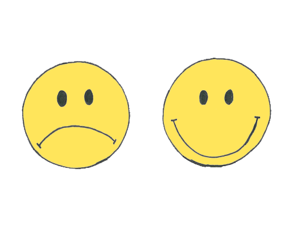

```{r, include=FALSE}
library(tidyverse)
library(thematic)
library(showtext)
font_add_google("Pangolin", "Pangolin")
showtext_auto()
```

# General emotions

When we look at our primary emotions we also feel a wide range of nuanced feelings.

```{r, echo=F}
pe <- c('Happiness', 'Sadness', 'Anger', 'Fear', 'Surprised', '')
nf <- c('Excitment', 'Relaxation', 'Confusion', 'Disappointment', 'Embarrassment', 'Pride')
df <- data.frame('Primary Emotions' = pe, 'Nuanced Feelings' = nf, row.names = NULL)
knitr::kable(df, escape = FALSE, align = 'c')
```

::: {.callout-note}
You can categorize these emotions into 3 groups: 

- Baseline Emotions
- Midline Emotions
- Apex Emotions. 

This classification refers to the intensity of emotions, ranging from mild to extreme. 
:::

::: {.callout-note}
Emotions often exist on a spectrum, varying in strength and impact. 
The magnitude of emotions can be influenced by personal sensitivity, context, or external factors, causing them to fluctuate in depth and duration. 
:::
 
We will explore the most commonly used words to express emotions based on their intensity.

```{r, echo=F}
create_links <- function(phrase) {
  words_in_phrase <- unlist(strsplit(phrase, " / "))
  links <- sapply(words_in_phrase, function(word) {
    paste0("[", word, "](https://www.merriam-webster.com/dictionary/", gsub(" ", "%20", word), ")")
  })
  paste(links, collapse=" / ") 
}

emo <- c('Happiness', 'Sadness', 'Anger', 'Fear', 'Surprised', 'Excitment', 'Relaxation', 'Confusion', 'Disappointment', 'Embarrassment', 'Pride')
mild <- c('Happy / Cheerful', 'Sad / Unhappy / Gloomy', 'Annoyed / Frustrated', 'Scared / Worried', 'Surprised / Startled', 'Excited / Eager', 'Relaxed / At ease', 'Confused', 'Disappointed', 'Embarrassed', 'Proud')
mode <- c('Joyful / Delighted / Elated', 'Sorrowful / Dejected / Miserable', 'Angry / Mad / Indignant', 'Afraid / Anxious / Alarmed', 'Astonished / Stunned', 'Enthusiastic / Pumped', 'Calm / Peaceful', 'Puzzled / Bewildered', 'Letdown / Disheartened', 'Ashamed', 'Pleased / Gratified')
high <- c('Thrilled / Overjoyed / Ecstatic', 'Heartbroken / Depressed', 'Furious / Enraged / Irate', 'Frightened / Terrified', 'Amazed / Shocked', 'Stoked', 'Tranquil', 'Perplexed', 'Crestfallen', 'Humiliated / Mortified', 'Triumphant')
df <- data.frame(Emotion = emo, Mild = mild, Moderate = mode, High = high) %>% 
  rowwise() %>% 
  mutate(Mild = create_links(Mild),
         Moderate = create_links(Moderate),
         High = create_links(High))
knitr::kable(df, escape = FALSE, align = 'c')
```

# Happy \& Sad

{width=100%, fig-align="center"}

```{r, include=FALSE}
sads <- c('sad', 'unhappy', 'gloomy', 'sorrowful', 'dejected', 'miserable', 'heartbroken', 'depressed')
joys <- c('happy', 'cheerful', 'joyful', 'delighted', 'elated', 'thrilled', 'ecstatic', 'overjoyed')
df <- data.frame(
  happy = sapply(joys, function(word) {
    paste0("[", word, "](https://www.merriam-webster.com/dictionary/", word, ")")
}),
  sad = sapply(sads, function(word) {
    paste0("[", word, "](https://www.merriam-webster.com/dictionary/", word, ")")
}), row.names = NULL
)
```


```{r, echo=FALSE, fig.showtext=T, fig.align='center'}
knitr::kable(df, escape = FALSE, align = 'c')
words <- data.frame(sad = sads,
                    happy = joys,
                  level = c(1:8))
thematic_on(font = 'Pangolin')
ggplot(words, aes(y = level, size = level)) +
  geom_text(aes(label = happy, x = 0.2, color = level)) +
  geom_text(aes(label = sad, x = 0.8, color = level)) +
  geom_vline(aes(xintercept = 0.5)) +
  scale_color_gradientn(colors = blues9[4:9], guide = 'none') +
  scale_size(range = c(4, 10), guide = 'none') +
  coord_cartesian(xlim = c(0, 1), ylim = c(0.5, 8.5), expand = F) +
  theme_void() +
  theme(panel.background = element_rect(fill = '#fafafa'))
```
# Examples

## Happy

- "I was happy to see my friend, but I was overjoyed when they surprised me with tickets to the concert." 

::: {.callout-tip collapse="true"}
Happy is a baseline, overjoyed is a much stronger level of happiness.
:::

- "She felt cheerful after a good workout, but she was ecstatic when she learned she got the job she had been hoping for." 

::: {.callout-tip collapse="true"}
Cheerful is a mild happiness, ecstatic is an intense, overwhelming joy.
:::

- "He was delighted to receive a birthday card, but he was thrilled to win the lottery." 

::: {.callout-tip collapse="true"}
Delighted is a pleasant level of happiness, thrilled is an exciting and exhilarating feeling.
:::

## Sad

- "I felt sad when it rained on my picnic, but I was heartbroken when my pet died." 

::: {.callout-tip collapse="true"}
Sad is a general feeling of unhappiness, while heartbroken is a much deeper and more intense sadness.
:::

- "She was unhappy about the traffic delay, but she was miserable after losing her job." 

::: {.callout-tip collapse="true"}
Unhappy is a mild form of discontent, while miserable describes a state of extreme unhappiness and discomfort.
:::

- "He felt dejected after losing the game, but he was depressed for weeks after the breakup." 

::: {.callout-tip collapse="true"}
Dejected is a feeling of sadness and discouragement, while depressed is a more severe and persistent state of sadness.
:::

